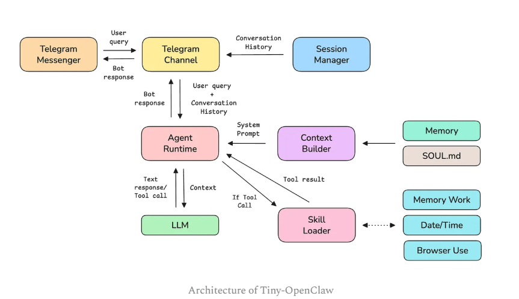

<h1>Tiny-OpenClaw</h1>

<b>Brief Idea of Tiny-OpenClaw :</b>  

1) Runs on a Mac/ Windows/ Linux machine

2) Can browse the internet, fill forms, and gather data from websites

3) Uses Skills

4) Has persistent memory

5) One can use Telegram to communicate with it

6) Tiny-OpenClaw does not have full system access on a machine, as it poses significant security risks, and this tutorial is not intended for creating an AI bot for production use.

<b>Components That Make Up Tiny-OpenClaw:</b> 

Before we start coding, let’s understand the 8 components that make up Tiny-OpenClaw.

1) Telegram Channel: This is an adapter specific to the messaging platform that translates messages from the platform’s format to a standard format that OpenClaw can work with.

2) Session Manager: This manages separate sessions and conversation histories per user.

3) Agent runtime: This is a loop that sends prompt and context to an LLM agent, runs tools if needed, and returns a final answer.

4) Memory: This is the storage that helps persist a user’s data across different chat sessions.

5) SOUL.md: This markdown file defines the agent’s personality and operating rules.

6) Skills: These are folders containing instructions, scripts, and resources to help complete a specific task.

7) Skills loader: This looks for the available Skills at startup, reads each Skill’s description and tools, and routes tool calls from the LLM to the right handler.

8) Context builder: This combines the following and returns context for the LLM:

    a) SOUL.md

    b) Skill descriptions

    c) Saved memory about the user

    d) Current time

